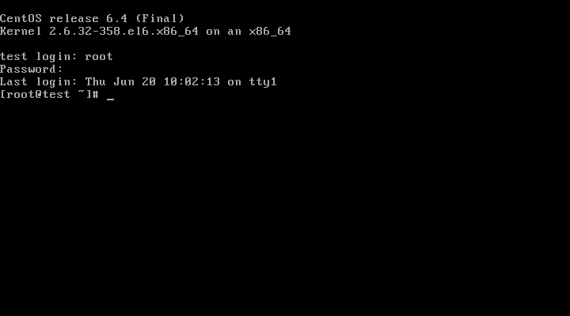

# The Basics

## Access a shell prompt and issue commands with correct syntax.
The shell prompt is the core of the RHEL experience (and Linux in general). Simply this is because the majority of systems are headless servers. These will not generally have a desktop environment installed.

In the case, access a prompt is very simple. You walk up to the console and log in.



## Use input-output redirection (>, >>, |, 2>, etc.)
Input/output redirection is the way of controlling where a command's output goes and where it gets input from. 

* STDIN - standard input
  * Could be what the shell sees when you type text on keyboard.
  * Could also be text sent to the command from another command via a _pipe_.
* STDOUT - standard output is where the command sends most of is normal output.
* STDERR - standard error us where the command sends information when something bad happens.


`command > file` is is the simpliest form of redirection. It takes the STDOUT from a command and sends it to file called `file`.

`command < file` tells a command to read the contents of `file` via STDIN

## Text Analysis

This is without a shadow of a doubt one of the most important things that any System Administrator does. When something is broken, or just not working as it should, your first port of call is the _logs_. This are (potentially) very big text files, and you will need to find what you need in them.

The primary tool for this is an old utility called `grep`. This looks through a given file for a given piece of text. The format is quite simple:

```
grep 'string to search for' filename
```

So if you want to know what packages have been installing you would run:

<<[Searching for Yum in system logs](code/grep-yum.txt)

That command searched through /var/log/messages for every line that contains the text string `yum`.

If no file is specified, you `grep` takes its input from STDIN:

```
dmesg | grep 'e1000'
```

will find any mentions of an Intel gigabit NIC driver in the startup logs.

That little line is the most basic usage of `grep`. It is a lot more powerful than that. By using the flag `-E` you are no longer looking for a simple string in a file, but a _Regular Expression_ (or REGEX as they are called by those in the know). These strike fear into many, even seasoned, sysadmins; they can be extremely complicated, but you can start of quite simple fairly easily.

The simplest use of a Regex is the literal characters. This is effectively the same as an exact string match. Adding `-E` to the `grep` command above would have the exact results. The power of them come in when you start using the special characters (or metacharacters):

  * `|` is basically an *or* character. If you do not know if you are search an English or American document, you could use `colour|color` and if will find all instances of  *colour* in both languages.
  * `.` matches any single character. For example `q.e` matches *qwe*, *qre* or any other 3 character string that starts with `q` and end in `e`.
  * `[ ]` denotes a _character class_ which matches one of the several characters.
    * `gr[ea]y` matches either *grey* or *gray*, but not *greay*.
    * Adding a `-` between the characters denotes a range. `[0-9]` will match any *single digit* number.
    * These can be combined, so `[0-9a-fA-F]` will match any single digit hexadecimal number.
    * Starting with a `^` negates the class. `q[^u]` means "*q* followed by a character that is not *u*", such as *iraq is*, but not *question*.
  *  `^` is the beginning of a line. `^[hc]at` matches *hat* and *cat*, but only at the start of a line.
  * `$` is the end of a line. `[hc]at]$` matched both *hat* and *cat* at the end of a line.
  * `?` matches the preceding element 0 or 1 times. `ab?c` matches *ac* and *abc*. 
  * `*` matches the preceding element 0 or more times. `ab*c` matches *ac*, *abc*, *abbc*, *abbbc* and so on.
  * `+` matches the preceding element 1 or more times. `ab+c` matches *abc*, *abbc*, *abbbc* and so on. 
  * `{m,n}` matches the preceding element at least `m` times and a maximum of `n` times. So `a[2,3]` will match *aa* and *aaa*. 

If you want to search for any of the above characters then you need to *escape* them using `\`. So \[.\] will match any single character that is enclosed in square brackets.  

## Remote Access

### SSH
For accessing remote servers, SSH is with out a doubt the standard. It is installed and enabled by default on RHEL - the firewall is even open on the correct port (22 tcp) too.

SSH stands for *Secure SHell", even though it is not actually a shell in itself. It is just a way of encrypting a connection to a shell (such as bash). You connect to 

### VNC
*Virtual Networking Computing* is a way to access a GUI on a remote server.


Configuring VNC comes in 2 stages:
   
   - general system
   - individual user

Since RHEL6 the package has been called *tigervnc-server*, so to install simply run:

```
sudo yum install tigervnc-server
```

All the configuration is on `/etc/sysconfig/vncservers`. Add the following:

```
VNCSERVERS="1:bob"
VNCSERVERARGS[1]="-geometry 1280x800"
```

Each VNC server has its own password. Incidentally, that is one of my personal beefs with VNC, but that is an aside. To set the password run `vncpassword`, which will create the file `~/.vnc/passwd`

Finally start the service and configure it to start on boot:

```
sudo chkconfig vncserver on
sudo service chkconfig start
```

The first time you run this, it will actually create a startup script (`~/.vnc/xstartup`) which will look like:

<<[VNC xstartup script](code/vnc-xstartup)

Finally, you need to open out up the firewall to allow to you access it. VNC requires a single TCP port per server and each user has their own server. By default this will start at 5901 and continue upwards.

```
sudo firewall-cmd --permanent --add-port=5901/tcp
sudo firewall-cmd --reload
```


## Log in and switch users in multiple runlevels


## Archiving/Compressing files

The basic compression format in RHEL is the `tar` file, which stands for *Tape ARchive*. Unsurprisingly, this dates back to the days when one would backup your files to a tape (which does still happen). Tar has no concept of compression, all it does is create an archive. The format is:

    tar <options> <archive-name> <files>

So a simple example would be:


    tar cpf ~/lean-rhcsa.tar ~/lean-rhcsa/manuscript ~/lean-rhcsa/assets

The above command creates an archive at the root of my home directory (~/lean-rhcsa.tar) that contains the folders for my manuscript and the associated assets for this book. The options are very simple:

   - `c` create an archive
   - `f` which file to create
   - `p` preserve permissions

The archive name can also be `-` which means STDOUT. This way you can send the archive to another program, such as a compressor. In order to compress the archive with `bzip2` you can run:


    tar cfp - ~/lean-rhcsa/manuscript ~/lean-rhcsa/assets | \
        bzip2 > ~/lean-rhcsa.tar.bz2


There is actually a shorthand for that though:

    tar cjfp ~/lean-rhcsa.tar.bz2 ~/lean-rhcsa/manuscript ~/lean-rhcsa/assets

This will do exactly the same, but is a little simpler.

A> ## File compressors {#file-compressors}
A> When piping you can use pretty much any compressor available.
A>
A> Personally I tend towards `bzip2` as it is good balance of speed and compression. Modern versions also have pretty good multi-threading.
A>
A> There is also `gz` which uses the zip algorithm. It is less CPU intensive, but also less efficient. This *may* be perferable on really low power systems (an older ARM SoC for example). On modern Intel/AMD systems the processing time saved is barely measurable most of the time.

## Creating and editing text files


## Manipulating files and directories

## Hard and soft links

## Permissions
List, set, and change standard ugo/rwx permissions.

## System Documentation
man, info, and files in /usr/share/doc
